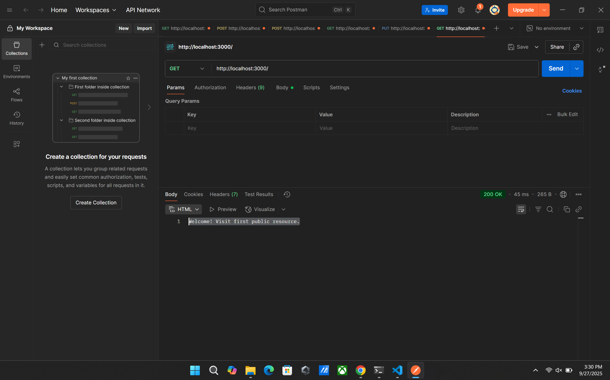
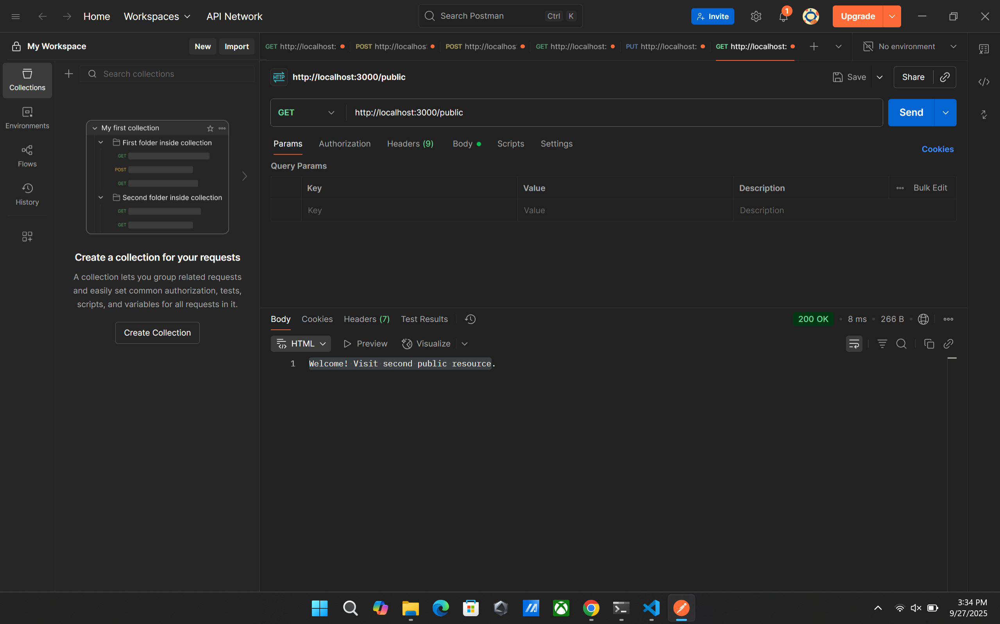
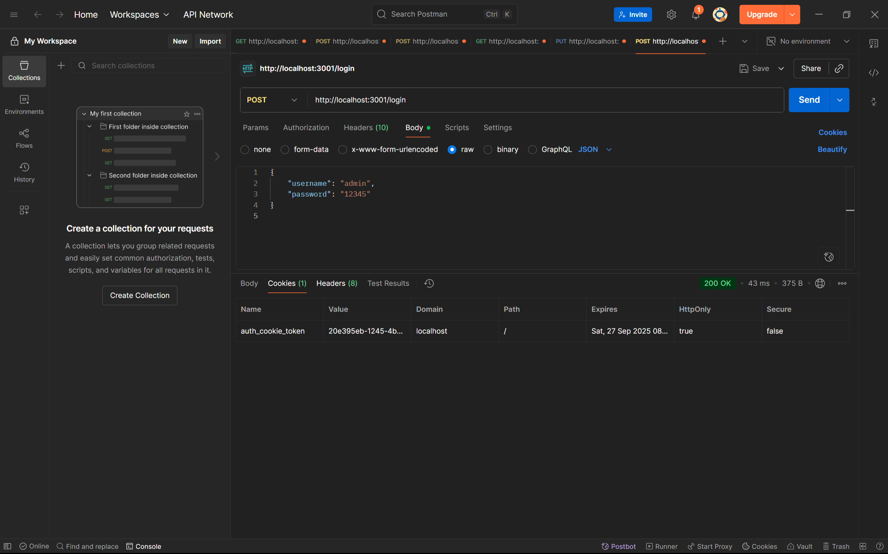
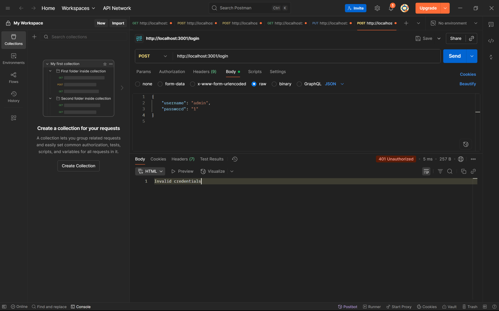
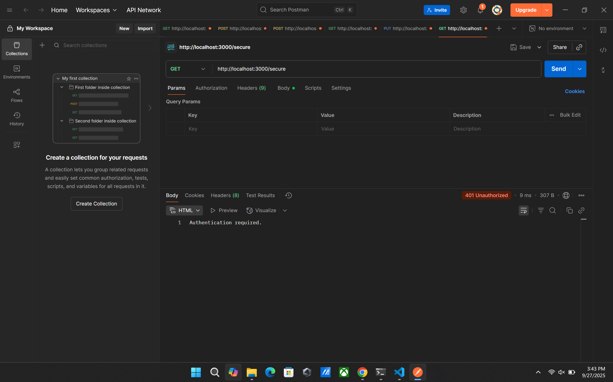
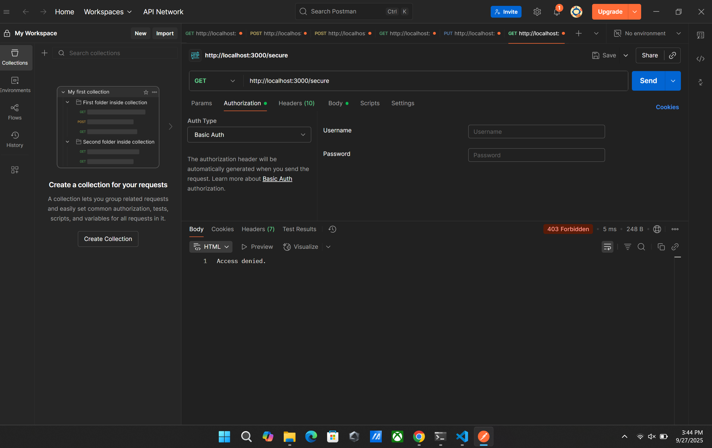
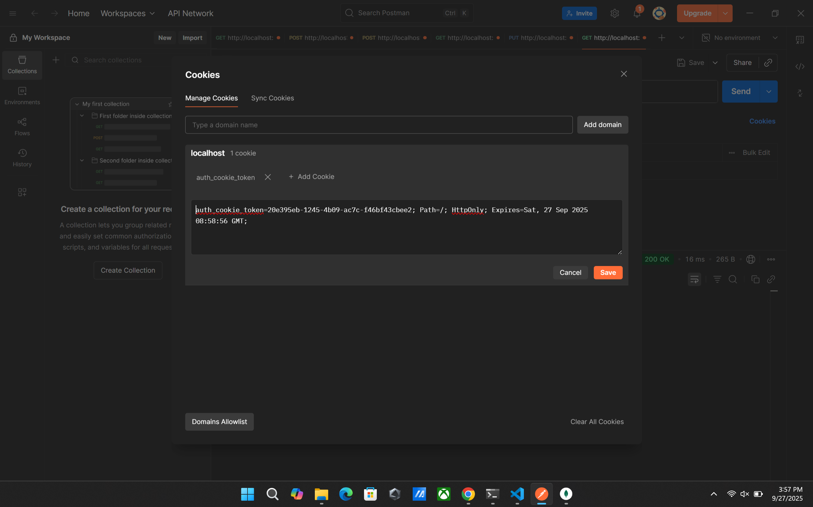
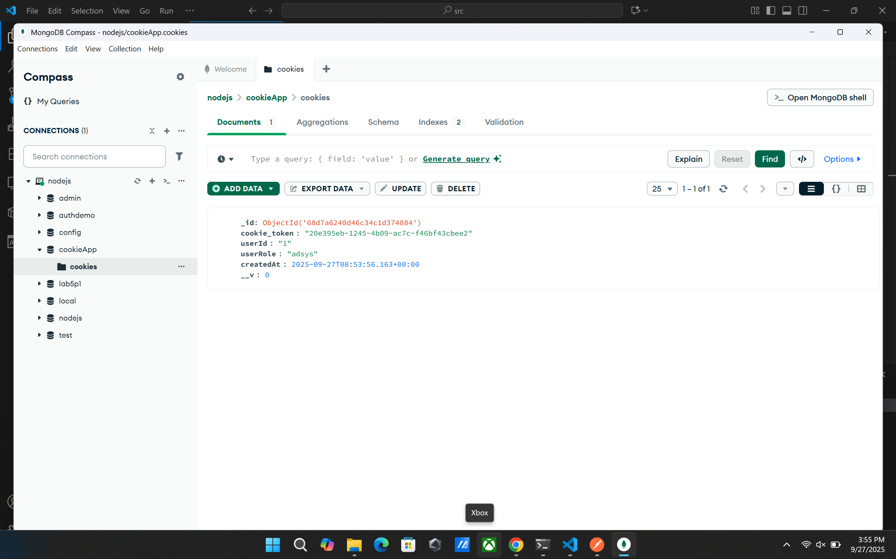
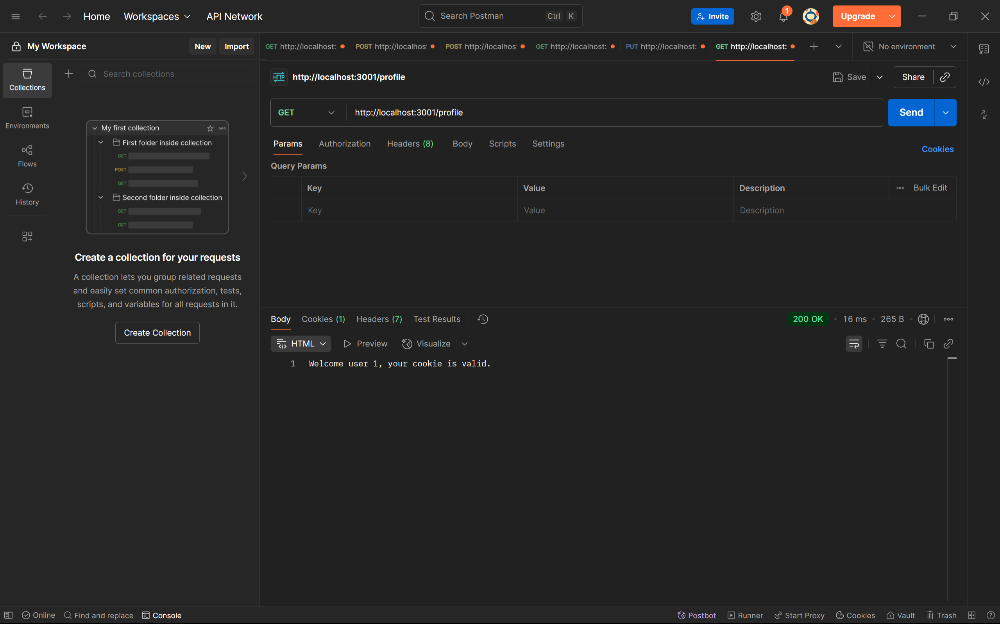

# Simple Auth APIs

## Giới thiệu
Thư mục này gồm hai ví dụ xác thực:
- **Basic Auth**: Xác thực cơ bản qua header Authorization.
- **Cookie Auth**: Xác thực qua cookie và lưu trạng thái đăng nhập.

## Cách test API

### 1. Basic Auth

- **Truy cập public route**
  - GET `/` hoặc `/public`
  - 
  - 

- **Truy cập secure route**
  - GET `/secure` với header `Authorization: Basic ...` (username và password lấy từ file .env)
  - Đúng thông tin: 
  - Sai thông tin: 
  - Không gửi header: 
  - Sai thông tin: 

### 2. Cookie Auth

- **Đăng nhập**
  - POST `/login` với thông tin người dùng
  - Thành công: , 

- **Truy cập profile**
  - GET `/profile`
  - Chưa đăng nhập: 
  - Đã đăng nhập: 

- **Đăng xuất**
  - GET `/logout`
  - 

## Khởi chạy
1. Cài đặt package:
   ```bash
   npm install
   ```
2. Tạo file `.env`.
3. Chạy server:
   ```bash
   node basic_auth.js
   ```
   hoặc
   ```bash
   node cookie_auth.js
   ```
4. Test API bằng Postman hoặc curl.

## Hình ảnh minh họa
Các hình ảnh kết quả test API nằm trong thư mục `public/results`.
